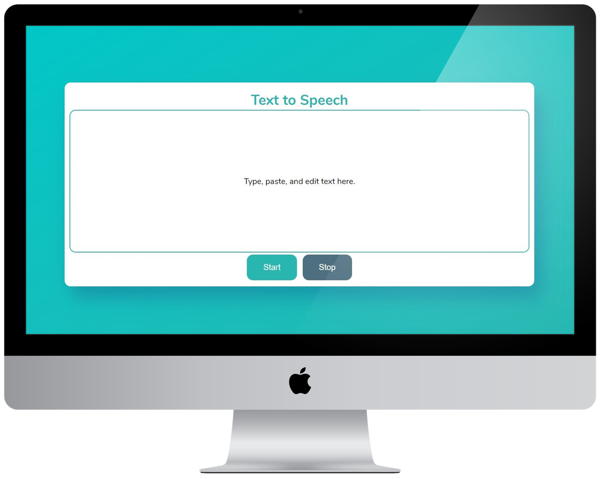

<h1 align="center">Text to Speech</h1>

Web application that converts written text into spoken words.

  

  

<h3 align="center">
  Participants
</h3> 

  

  <a href="https://github.com/CaioLemec">
    GitHub
  </a>

<h3 align="center">
  Tecnology
</h3>

  

<h3 align="center">
  Start Dev Environment for VSCode
</h3> 

<blockquote>
1. Open project folder in VSCode.  
2. Install Live Server extension.   
3. Right click index.html then Open with Live Server.  
4. Access the generated address in your browser.  
<blockquote>

